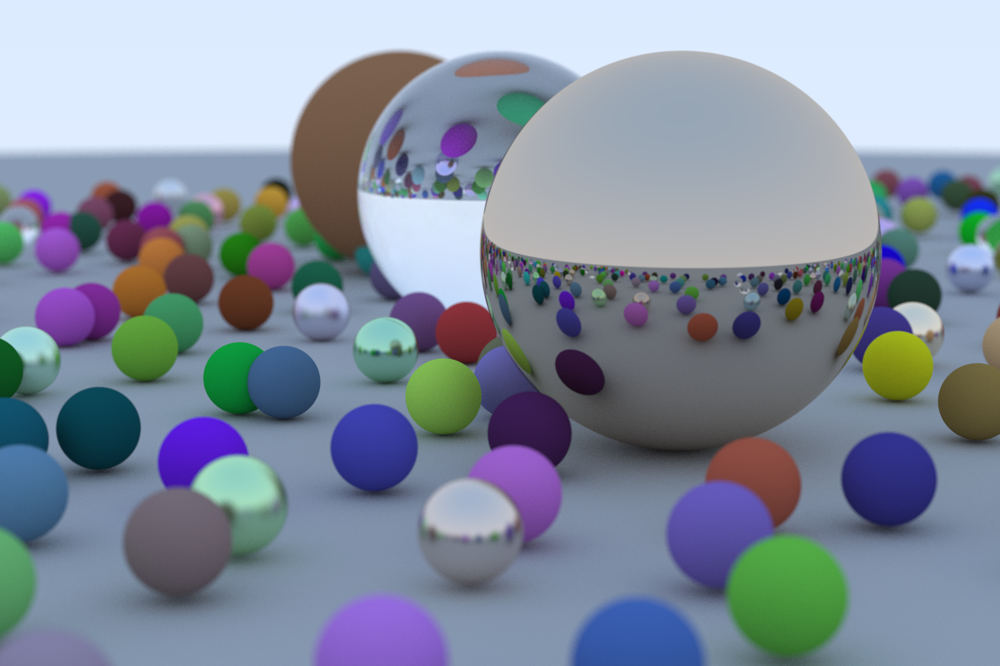

# Ray Tracing in One Weekend (in Rust)

An implementation of the ray tracer from [_Ray Tracing in One Weekend_](https://raytracing.github.io/books/RayTracingInOneWeekend.html) by Peter Shirley in [Rust](https://www.rust-lang.org/).
While the file and class structure is largely the same, I made a few changes to translate the original C++ code into
more idiomatic Rust. The translation was otherwise fairly straightforward.

* Returning an `Option<T>` instead of `-1` for cases like `hit` when we don't hit an object and don't have a value to return. This also gets rid of having to pass a reference to the output variable and assigning it within a function.
* Replacing `std::shared_ptr` with `std::rc::Rc` (thank you to pie_flavor#7868 from [The Rust Programming Language Discord](https://discord.gg/rust-lang) for helping me understand lifetimes better 😊)

## Future Work

* [x] Parallelism (rendering the final scene takes a *huge* (178m12s with 200 threads) amount of time)
* [ ] Triangles (implement model I/O)
* [ ] Lights (will make everything look prettier; use shadow rays or bias rays towards lights with downweighting)
* [ ] Surface Textures (will make everything look prettier)
* [ ] Solid Textures (generative textures, Perlin noise)
* [ ] Volumes and Media (make volumes have hittable surfaces with probabilistic intersections based on density)
